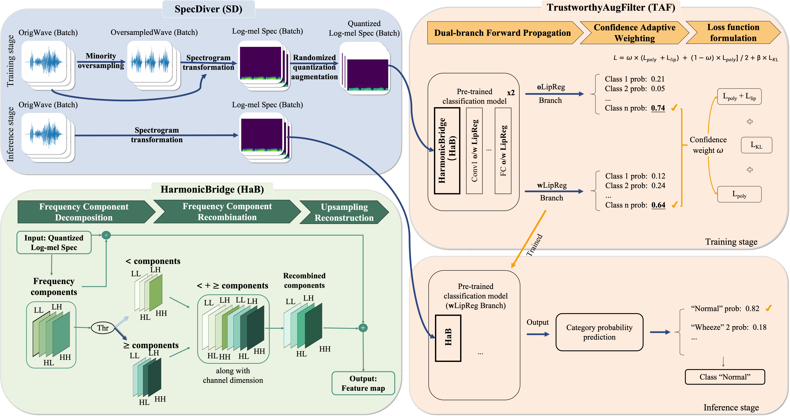

# STAH: Spectral-Trustworthy Augmentation Harmonizer

Official implementation of **"Spectral-Trustworthy Augmentation Harmonizer towards Automated Lung Auscultation under Pathological Sample-scarcity Scenario"** (IEEE TASLP 2026).

## Overview


STAH is a novel framework for automated lung auscultation comprising three synergistic components:
- **SpecDiver (SD)**: Multi-level resampling with Borderline-SMOTE2 and Randomized Quantization
- **TrustworthyAugFilter (TAF)**: Dual-branch architecture with Lipschitz regularization for quality control
- **HarmonicBridge (HaB)**: Wavelet-based domain adaptation bridging natural images and spectrograms

## Installation

```bash
git clone https://github.com/wangying1586/STAH_Automated-Lung-Auscultation.git
cd STAH_Automated-Lung-Auscultation
pip install -r requirements.txt
```

## Dataset Preparation

### SPRSound 2022/2023
Download from [SJTU-SPRSound](https://github.com/SJTU-YONGFU-RESEARCH-GRP/SPRSound).

Directory structure:
```
datasets/
├── sprsound_2022/
│   ├── train_classification_wav/
│   ├── train_classification_json/
│   ├── valid_classification_wav/
│   ├── valid_classification_json/
└── sprsound_2023/
    ├── valid_classification_wav/
    └── valid_classification_json/
```

### ICBHI 2017
Download from [ICBHI_2017_Challenge](https://bhichallenge.med.auth.gr/ICBHI_2017_Challenge).

Directory structure:
```
datasets/
└── ICBHI_final_database/
    ├── audio_and_txt_files/
    └── ICBHI_challenge_train_test.txt
```

## Training

### SPRSound 2022 (5-Fold Cross Validation)

Task 1-1 (Binary):
```bash
python train.py \
    --dataset_type SPRSound22_23 \
    --task_type 11 \
    --train_wav_path ./datasets/sprsound_2022/train_classification_wav \
    --train_json_path ./datasets/sprsound_2022/train_classification_json \
    --feature_extractor EfficientNet-B4 \
    --feature_type log-mel \
    --HaB True \
    --R_Drop True \
    --Lipschitz_regularization True \
    --PolyCrossEntropyLoss True \
    --use_oversampling True \
    --oversamplers Borderline_SMOTE2 \
    --Rrandomized_Quantization_Aug True \
    --batch_size 32 \
    --epoch 300 \
    --lr 0.0001 \
    --n_splits 5
```

Task 2-2 (5-class):
```bash
python train.py \
    --dataset_type SPRSound22_23 \
    --task_type 22 \
    --train_wav_path ./datasets/sprsound_2022/train_classification_wav \
    --train_json_path ./datasets/sprsound_2022/train_classification_json \
    --feature_extractor EfficientNet-B4 \
    --batch_size 8 \
    --epoch 300 \
    --n_splits 5 \
    --HaB True \
    --R_Drop True \
    --Lipschitz_regularization True \
    --PolyCrossEntropyLoss True \
    --use_oversampling True \
    --oversamplers Borderline_SMOTE2 \
    --Rrandomized_Quantization_Aug True
```

### ICBHI 2017 (5 Random Seeds)

Binary classification (Task 11):
```bash
python train.py \
    --dataset_type ICBHI2017 \
    --task_type 11 \
    --ICBHI_data ./datasets/ICBHI_final_database \
    --ICBHI_split_txt ./datasets/ICBHI_final_database/ICBHI_challenge_train_test.txt \
    --feature_extractor MobileViTV2-125 \
    --feature_type log-mel \
    --HaB True \
    --R_Drop True \
    --Lipschitz_regularization True \
    --PolyCrossEntropyLoss True \
    --use_oversampling True \
    --oversamplers Borderline_SMOTE2 \
    --Rrandomized_Quantization_Aug True \
    --batch_size 32 \
    --epoch 300 \
    --n_seeds 5 \
    --base_seed 0
```

4-class classification (Task 12):
```bash
python train.py \
    --dataset_type ICBHI2017 \
    --task_type 12 \
    --ICBHI_data ./datasets/ICBHI_final_database \
    --ICBHI_split_txt ./datasets/ICBHI_final_database/ICBHI_challenge_train_test.txt \
    --feature_extractor MobileViTV2-125 \
    --batch_size 32 \
    --epoch 300 \
    --n_seeds 5 \
    --HaB True \
    --R_Drop True \
    --Lipschitz_regularization True \
    --PolyCrossEntropyLoss True \
    --use_oversampling True \
    --oversamplers Borderline_SMOTE2 \
    --Rrandomized_Quantization_Aug True
```

### Available Arguments

| Argument | Description | Options |
|----------|-------------|---------|
| `--dataset_type` | Dataset | `SPRSound22_23`, `ICBHI2017` |
| `--task_type` | Task ID | `11`, `12`, `21`, `22` |
| `--feature_extractor` | Backbone | `EfficientNet-B4`, `ResNet50`, `DenseNet121`, `ConvNeXt_base`, `MobileViTV2-050~200`, `StarNet-T0/S4/B1` |
| `--HaB` | Enable HarmonicBridge | `True`, `False` |
| `--R_Drop` | Enable R-Drop | `True`, `False` |
| `--Lipschitz_regularization` | Enable Lipschitz reg | `True`, `False` |
| `--PolyCrossEntropyLoss` | Use PolyLoss | `True`, `False` |
| `--use_oversampling` | Enable SpecDiver | `True`, `False` |
| `--oversamplers` | Oversampling method | `Borderline_SMOTE2`, `SMOTE`, `ADASYN` |
| `--Rrandomized_Quantization_Aug` | Enable RQ augmentation | `True`, `False` |
| `--audio_augment_type` | Audio augmentation | `time_stretch`, `pitch_shift`, `noise_injection` |

## Testing

### SPRSound Evaluation

```bash
python test.py \
    --task_type 11 \
    --exp_dir ./experiments/SPRSound22_23_task11_EfficientNet-B4_... \
    --dataset_type SPRSound22_23 \
    --test_2022_wav_path ./datasets/sprsound_2022/test_wav \
    --test_2022_json_path ./datasets/sprsound_2022/test_json \
    --test_2023_wav_path ./datasets/sprsound_2023/restore_valid_classification_wav \
    --test_2023_json_path ./datasets/sprsound_2023/valid_classification_json \
    --feature_extractor EfficientNet-B4 \
    --HaB True \
    --batch_size 128
```

### ICBHI Evaluation

```bash
python test.py \
    --task_type 11 \
    --exp_dir ./experiments/ICBHI2017_task11_MobileViTV2-125_... \
    --dataset_type ICBHI2017 \
    --icbhi_data_dir ./datasets/ICBHI_final_database \
    --icbhi_split_file ./datasets/ICBHI_final_database/ICBHI_challenge_train_test.txt \
    --feature_extractor MobileViTV2-125 \
    --HaB True \
    --batch_size 128
```

## Project Structure

```
STAH/
├── train.py                  # Training script
├── test.py                   # Evaluation script
├── feature_extractor/        # Backbone architectures with HaB
│   ├── EfficientNet.py
│   ├── HaB_ResNet.py
│   ├── HaB_DenseNet.py
│   ├── HaB_ConvNeXt.py
│   ├── HaB_MobileViTV2_timm.py
│   └── HaB_StarNet.py
├── datasets/                 # Data loaders
│   ├── SPRSound_dataloader.py
│   ├── ICBHI2017_dataset.py
│   └── Randomized_QuantizationAug.py
├── loss/                     # Loss functions
│   ├── polyloss.py
│   └── Lipschitz_regularization_loss.py
├── utils/                    # Utilities
│   ├── comet_record.py
│   ├── evaluation_metrics.py
│   ├── oversampling.py
│   └── train_trick.py
└── experiments/              # Auto-generated experiment dirs
```

## Citation

```bibtex
@ARTICLE{11457658,
  author={Wang, Ying and Wang, Fan and Huang, Guoheng and Zheng, Xiaobin and Lei, Baiying and Yuan, Xiaochen},
  journal={IEEE Transactions on Audio, Speech and Language Processing}, 
  title={Spectral-Trustworthy Augmentation Harmonizer Toward Automated Lung Auscultation Under Pathological Sample-Scarcity Scenario}, 
  year={2026},
  volume={34},
  number={},
  pages={2007-2020},
  keywords={Lungs;Adaptation models;Pathology;Acoustics;Time-frequency analysis;Data mining;Visualization;Transfer learning;Spectrogram;Quantization (signal);Automated lung auscultation;deep learning;data quality control;domain adaptation},
  doi={10.1109/TASLPRO.2026.3678800}}
```
